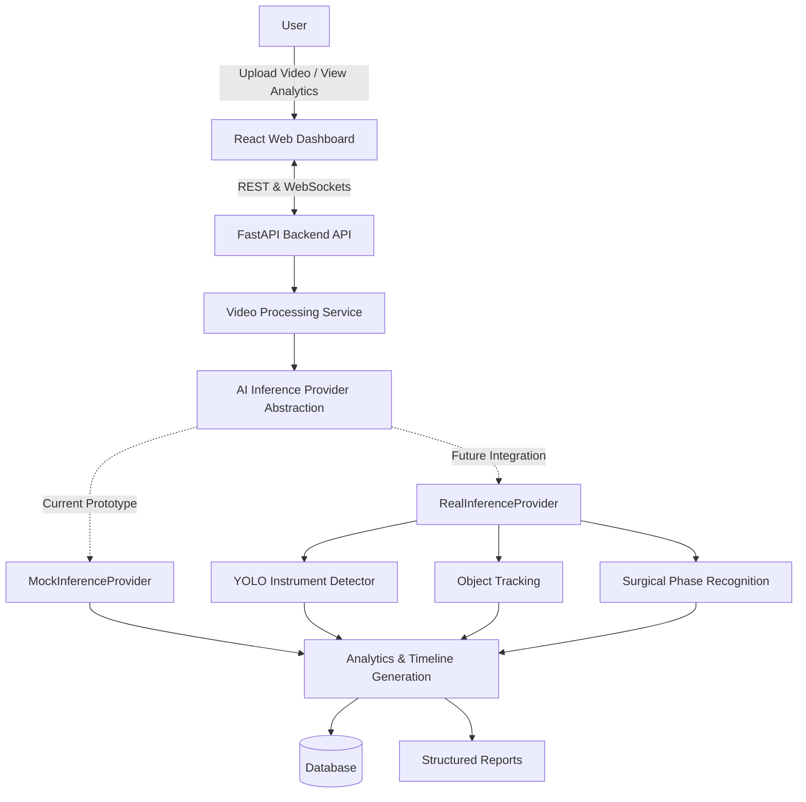

# SurgiVision AI
### A Real-Time Intelligent Surgical Video Analytics Platform for Instrument Detection, Tracking, and Surgical Phase Recognition


SurgiVision AI is an academic research-oriented major project designed to process and analyze laparoscopic and endoscopic surgical videos. The platform aims to automatically detect surgical instruments, track their usage over time, recognize surgical workflow phases, and generate structured procedure summaries through a web-based dashboard.

> **Disclaimer**: This is a Research & Educational Prototype — Not intended for clinical diagnosis, treatment, or real-time medical decision-making. The scope of this project explicitly excludes robotic surgery control and deployment in live operating rooms.

---

## Abstract

The official project abstract is available separately:

[Read the Project Abstract](ABSTRACT.md)

---

## Project Overview

### Problem Statement & Motivation
During minimally invasive surgeries, surgeons experience high cognitive load. They must actively monitor video streams while keeping track of workflow phases, instrument usage, and critical events. 
Currently:
* Standard operating room systems only *record* video, offering no intelligent real-time insight.
* Manual documentation post-surgery is tedious and prone to human error.
* Existing AI solutions are largely limited to offline analysis or demand massive computational resources, making them impractical for standard clinical environments.

### Objectives & Proposed Solution
SurgiVision AI proposes to bridge this gap by offering a streamlined, deep learning-based platform that analyzes surgical video to provide intelligent timeline and analytics feedback for educational, research, and quality-assurance purposes.

### Project Scope & Limitations
**In Scope:**
* Fine-tuning a YOLO-based object detection model (Planned).
* Surgical instrument detection and tracking (Planned).
* Workflow phase recognition (Planned).
* Automated structured report generation.
* Web-based dashboard for interactive visualization.

**Limitations / Out of Scope:**
* Clinical diagnosis or treatment recommendations.
* Robotic surgery control or automation.
* Deployment in live operating room environments.
* Real-time clinical performance evaluation on patients.

---

## System Architecture

The project utilizes a decoupled architecture where the React frontend does not depend directly on a specific AI model. An `AIInferenceProvider` abstraction layer allows swapping simulated output for the real YOLO model once it is trained.



### AI Model Integration Interface
The system is designed to support:
1. Local YOLO `.pt` model
2. Hugging Face-hosted inference
3. Separate GPU inference service

Model configuration uses environment variables (e.g., `MODEL_PROVIDER=local`) to prevent exposing credentials. To maintain modularity, any integrated AI model must conform to a standardized JSON response format.

**Expected AI Response Schema:**
```json
{
  "frame_id": 125,
  "timestamp": 4.16,
  "detections": [
    {
      "class": "grasper",
      "confidence": 0.94,
      "bbox": [120, 80, 340, 290],
      "track_id": 1
    }
  ],
  "phase": {
    "name": "dissection",
    "confidence": 0.91
  }
}
```
*Note: This is an architectural schema definition, not measured experimental output.*

---

## Technical Architecture

### Frontend Modules
- **Architecture**: React SPA built with Vite and Tailwind CSS.
- **Pages**: Protected dashboard, video upload, analysis timeline visualization, analytics, and reports.
- **Components**: Recharts for timeline metrics, WebSocket client for live processing updates.

### Backend Architecture
- **API Framework**: FastAPI for high-performance REST and WebSocket endpoints.
- **Video Processing Pipeline**: Background tasks manage video reading, sending frames to the `AIInferenceProvider`, and emitting WebSocket progress events.
- **Database Architecture**: SQLAlchemy ORM with SQLite (for local development) mapping Videos, AnalysisSessions, Detections, Tracks, and SurgicalPhases.

---

## AI/ML Methodology (Planned)

### Dataset Strategy
1. **Validation**: Use short annotated clips to understand and validate the complete fine-tuning workflow.
2. **Main Experimentation**: Leverage publicly available surgical datasets such as **Cholec80** and **EndoVis**.

### YOLO Fine-tuning Plan
- **Object Detection**: Train Ultralytics YOLO models to identify standard surgical instruments.
- **Object Tracking**: Implement lightweight tracking algorithms to assign and maintain `track_id`s across frames.
- **Surgical Phase Recognition**: Correlate detected instruments and temporal context to predict surgical phases (e.g., Preparation, Dissection).
- **Timeline & Analytics Generation**: Aggregate frame-by-frame data into a comprehensive chronological summary.
- **Automated Report Generation**: Output structured data formats detailing the procedure's analytical flow.

---

## Current Implementation Status

SurgiVision AI is being developed in iterative phases.

**✅ Implemented (End-to-end Prototype & Real Model Integration)**
- React + Vite frontend and FastAPI backend.
- JWT authentication, user registration, user login, protected routes.
- SQLite database configuration.
- Video upload functionality with actual OpenCV frame extraction.
- Background video processing over WebSockets.
- `AIInferenceProvider` abstraction with both `RealInferenceProvider` (YOLO) and `MockInferenceProvider`.
- **Current implemented AI**: YOLOv8s-based surgical instrument detection utilizing the provided fine-tuned Cholec80 checkpoint.
- Analysis dashboard with real YOLO bounding box visualization, object tracking UI, and timeline analytics.
- Report generation foundation.

> **Important**: The platform can switch between Real Model Inference and Demo Mode via environment variables. When connected to the local YOLO model, it processes uploaded video frames and tracks real instruments, however, **surgical phase recognition** remains pending future integration.

**🔄 Under Development / 📋 Planned (Research Implementation)**
- Surgical phase recognition integration.
- Improved tracking (e.g. BoT-SORT fine-tuning).
- Timeline and report generation using phase model predictions.
- Quantitative evaluation (measuring Precision, Recall, mAP).
- Further fine-tuning experiments and integration of additional surgical datasets (e.g. EndoVis).
- Model optimization and cloud deployment.

---

## Evaluation Methodology (⏳ Evaluation Pending)

The proposed system will be quantitatively evaluated to assess its effectiveness as a research-oriented solution. No evaluation has been completed yet. Once the YOLO model is fine-tuned, the following metrics will be measured:
- **Precision**
- **Recall**
- **mAP**
- **Tracking accuracy**
- **Inference speed (FPS) / Latency**

---

## Security and Privacy Considerations
- Passwords are cryptographically hashed using Argon2.
- API endpoints are secured via JWT bearer tokens.
- **Privacy Warning**: As an educational prototype, no actual patient data or protected health information (PHI) should be uploaded to the system.

---

## Development Roadmap
- **Phase 1** — End-to-end prototype (✅ Completed)
- **Phase 2** — Dataset preparation (📋 Planned)
- **Phase 3** — Baseline YOLO model (📋 Planned)
- **Phase 4** — Fine-tuning (📋 Planned)
- **Phase 5** — Object tracking (📋 Planned)
- **Phase 6** — Surgical phase recognition (📋 Planned)
- **Phase 7** — Timeline and report generation (📋 Planned)
- **Phase 8** — Quantitative evaluation (⏳ Evaluation Pending)
- **Phase 9** — Model optimization (📋 Planned)
- **Phase 10** — Deployment and documentation (📋 Planned)

---

## Research Contribution / Future Scope
While novelty is pending evaluation, the project investigates the following areas:
- Integration of surgical instrument detection and tracking.
- Video-based surgical workflow analysis.
- Fine-tuning and evaluation of YOLO-based surgical instrument detection.
- Integration of AI inference with a web-based analytics platform.
- Evaluation of detection/tracking performance and inference speed.

---

## Installation & How to Run Locally

### Prerequisites
- Python 3.10+
- Node.js 18+

### Environment Variables
Create a `.env` file in the root directory (or rename `.env.example`):
```env
DATABASE_URL=sqlite:///./surgivision.db
SECRET_KEY=yoursecretkey
MODEL_PROVIDER=mock
VITE_API_URL=http://localhost:8000
```
*Note: Never expose real API keys or credentials in this file.*

### Backend Setup
```bash
cd backend
python -m venv venv
venv\Scripts\activate   # or source venv/bin/activate on macOS/Linux
pip install -r requirements.txt
uvicorn app.main:app --reload
```

### Frontend Setup
```bash
cd frontend
npm install
npm run dev
```
Visit `http://localhost:5173` to view the application.

---

## Repository Structure

```
SurgiVision-AI/
├── ABSTRACT.md              # Official project abstract
├── README.md                # Technical documentation
├── backend/                 # FastAPI server & services
│   ├── app/
│   │   ├── api/             # API routes
│   │   ├── core/            # Config & DB setup
│   │   ├── models/          # DB Models
│   │   ├── schemas/         # Pydantic validation
│   │   └── services/        # AI abstractions (Mock/Real)
│   └── requirements.txt
├── frontend/                # React application
│   ├── src/
│   │   ├── components/      
│   │   ├── context/         
│   │   ├── pages/           
│   │   └── App.jsx          
│   └── package.json
├── docs/
│   └── model-integration.md # AI integration docs
└── docker-compose.yml       # Infrastructure orchestration
```

---

## References

1. Frey, S., Facente, F., Wei, W., et al., "Optimizing Intraoperative AI: Evaluation of YOLOv8 for Real-Time Recognition of Robotic and Laparoscopic Instruments," *Journal of Robotic Surgery*, vol. 19, Article 131, 2025. https://doi.org/10.1007/s11701-025-02284-7
2. Ríos, M. S., Molina-Rodriguez, M. A., Londoño, D., et al., "Cholec80-CVS: An Open Dataset with an Evaluation of Strasberg’s Critical View of Safety for AI," *Scientific Data*, vol. 10, Article 194, 2023. https://doi.org/10.1038/s41597-023-02073-7
3. Pan, X., Bi, M., Wang, H., et al., "DBH-YOLO: A Surgical Instrument Detection Method Based on Feature Separation in Laparoscopic Surgery," *International Journal of Computer Assisted Radiology and Surgery*, vol. 19, pp. 2215–2225, 2024. https://doi.org/10.1007/s11548-024-03115-0
4. S. A. Khader, V. Ramakrishnan, A. Mansur, C.-F. J. Yang, L. Schumacher, and S. Manjanna, "Medical Surgery Stream Segmentation to Detect and Track Robotic Tools," *2024 IEEE First International Conference on Artificial Intelligence for Medicine, Health and Care (AIMHC)*, Laguna Hills, USA, 2024, pp. 194–200. https://doi.org/10.1109/AIMHC59811.2024.00043
5. C. K. R., N. P. S., N. E. U., and S. N. S., "Real Time Video Based Detection of Retained Surgical Instruments During Intraoperative Procedures," *2024 Control Instrumentation System Conference (CISCON)*, Manipal, India, 2024, pp. 1–6. https://doi.org/10.1109/CISCON62171.2024.10696273
6. Y. Zhao et al., "DETRs Beat YOLOs on Real-Time Object Detection," *Proceedings of the IEEE/CVF Conference on Computer Vision and Pattern Recognition (CVPR)*, Seattle, USA, 2024, pp. 16965–16974. https://doi.org/10.1109/CVPR52733.2024.01605
7. Liu, Y., Hayashi, Y., Oda, M., et al., "Enhancing YOLO for Laparoscopic Tool Detection: Novel Data Augmentation and Structural Modifications Addressing Mis-Detection of Bifurcated Targets," *International Journal of Computer Assisted Radiology and Surgery*, vol. 20, pp. 1899–1910, 2025. https://doi.org/10.1007/s11548-025-03352-x
8. Li, Y., Li, C., Zhang, K., Miao, Y., Shi, W., and Jiang, Z., "MCPD-YOLOv3: A Novel Lightweight Detection Model for Surgical Instruments in Laparoscopic Images," *The International Journal of Medical Robotics and Computer Assisted Surgery*, 2025, e70104. https://doi.org/10.1002/rcs.70104
